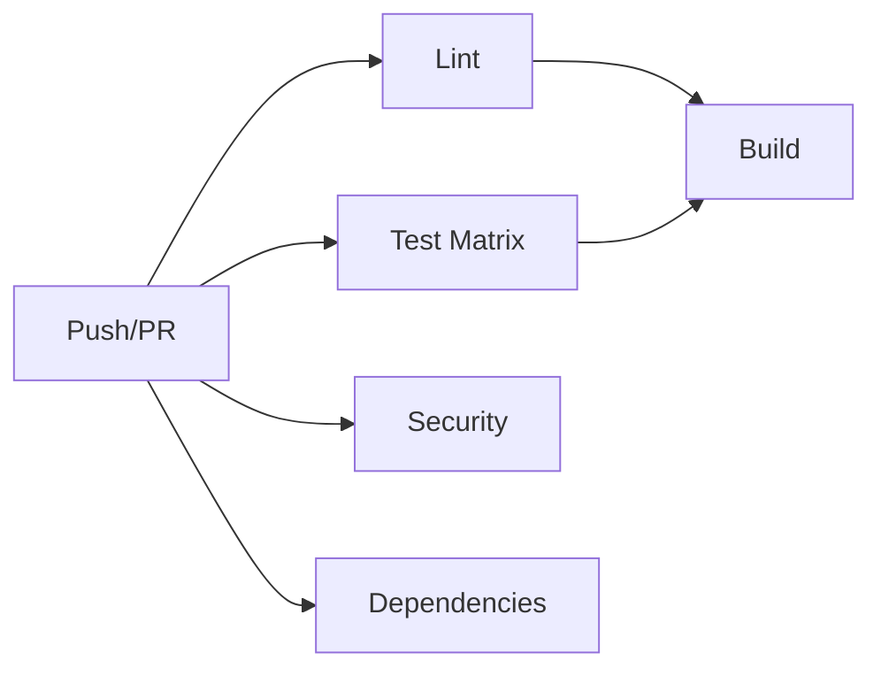
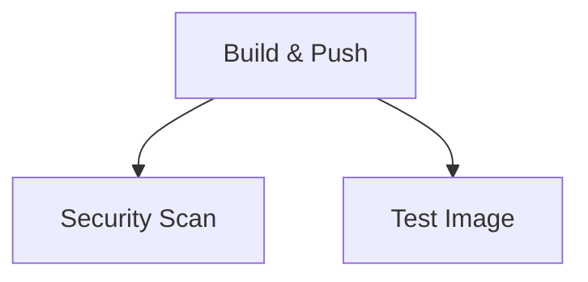
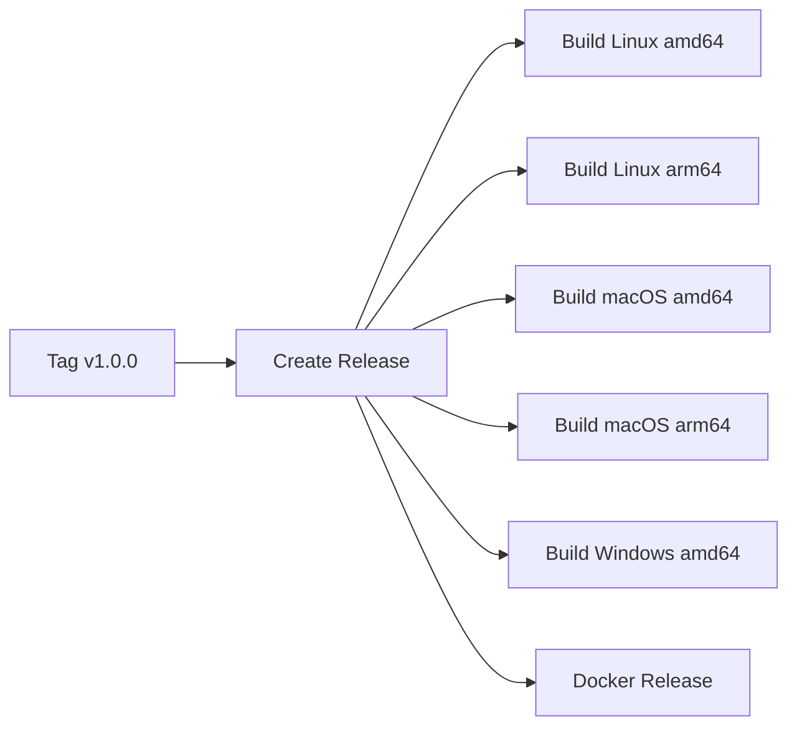

# 🚀 CI/CD Architecture - Scrum Center API

## 📊 Visão Geral

Este projeto utiliza **GitHub Actions** para automação completa de CI/CD com foco em:
- ✅ Qualidade de código
- ✅ Testes automatizados
- ✅ Segurança
- ✅ Deploy automatizado
- ✅ Paralelização máxima

## 🏗️ Estrutura de Workflows

### 1️⃣ CI Pipeline (`ci.yml`)

**Trigger:** Push/PR em `main` e `develop`

**Jobs Paralelos:**



| Job | Descrição | Duração Aprox. |
|-----|-----------|----------------|
| **lint** | golangci-lint + mod tidy check | ~1min |
| **test** | Testes em Go 1.20, 1.21, 1.22 (paralelo) | ~2min |
| **security** | gosec + SARIF upload | ~1min |
| **dependencies** | govulncheck | ~1min |
| **build** | Compila binário + upload artifact | ~30s |

**Features:**
- Cache de dependências Go
- Coverage report automático
- Upload para Codecov (Go 1.21)
- Matriz de testes para múltiplas versões

---

### 2️⃣ Docker Pipeline (`docker.yml`)

**Trigger:** Push em `main`/`develop`, tags `v*.*.*`, PRs

**Jobs Sequenciais:**



| Job | Descrição | Recursos |
|-----|-----------|----------|
| **build-and-push** | Build multi-arch + push GHCR | 2 plataformas |
| **security-scan** | Trivy vulnerability scan | SARIF |
| **test-image** | Smoke test da imagem | Health check |

**Features:**
- Multi-platform: `linux/amd64`, `linux/arm64`
- GitHub Actions Cache para layers
- Tags inteligentes baseadas em contexto
- Build provenance attestation
- Scan de vulnerabilidades automático

**Tag Strategy:**

| Evento | Tags Geradas |
|--------|-------------|
| Push `main` | `latest`, `main`, `main-{sha}` |
| Push `develop` | `develop`, `develop-{sha}` |
| Tag `v1.2.3` | `v1.2.3`, `1.2`, `1`, `latest` |
| PR #42 | `pr-42` |

---

### 3️⃣ Release Pipeline (`release.yml`)

**Trigger:** Tags `v*.*.*` (semver)

**Jobs Paralelos:**



**Binários Gerados:**
- ✅ Linux: amd64, arm64
- ✅ macOS: amd64 (Intel), arm64 (Apple Silicon)
- ✅ Windows: amd64

**Cada binário inclui:**
- SHA256 checksum
- Versão embutida via ldflags
- Otimizações de tamanho (`-s -w`)

---

### 4️⃣ Cleanup Pipeline (`cleanup.yml`)

**Trigger:** Semanalmente (segunda 00:00 UTC) ou manual

**Ações:**
- Remove imagens untagged
- Mantém últimas 10 versões
- Preserva tags importantes (latest, semver, main, develop)

---

## 🔐 Segurança

### Ferramentas Integradas:

| Ferramenta | Propósito | Quando Roda |
|-----------|-----------|-------------|
| **gosec** | Static analysis security | Todo push/PR |
| **govulncheck** | CVE em dependências | Todo push/PR |
| **Trivy** | Container vulnerability scan | Todo build Docker |
| **golangci-lint** | Code quality + security rules | Todo push/PR |

### SARIF Upload:
Todos os scans enviam resultados para GitHub Security tab.

---

## 📦 GitHub Container Registry

### Autenticação:
```bash
echo $GITHUB_TOKEN | docker login ghcr.io -u USERNAME --password-stdin
```

### Pull Imagens:
```bash
# Última versão
docker pull ghcr.io/jonathancarvalho39/scrum-center-api:latest

# Versão específica
docker pull ghcr.io/jonathancarvalho39/scrum-center-api:v1.2.3

# Branch
docker pull ghcr.io/jonathancarvalho39/scrum-center-api:develop
```

### Tamanho Final:
- **Build stage:** ~500MB (golang:1.22-alpine)
- **Final image:** ~15-20MB (distroless/static)

---

## 🎯 Performance Otimizações

### 1. **Caching Agressivo**
```yaml
# Go modules cache
uses: actions/setup-go@v5
with:
  cache: true

# Docker layers cache
cache-from: type=gha
cache-to: type=gha,mode=max
```

### 2. **Paralelização**
- Testes em matriz de Go versions
- Build de binários multi-platform simultâneo
- Jobs independentes executam em paralelo

### 3. **Build Otimizado**
```dockerfile
# CGO desabilitado = binary estático
CGO_ENABLED=0

# Flags de otimização
-ldflags='-w -s -extldflags "-static"'

# Distroless = imagem mínima
FROM gcr.io/distroless/static-debian12:nonroot
```

---

## 📈 Métricas de Pipeline

### Tempos Médios:

| Workflow | Tempo Total | Quando Roda |
|----------|-------------|-------------|
| CI Pipeline | ~3-4min | Todo push/PR |
| Docker Pipeline | ~5-7min | Push main/develop/tags |
| Release Pipeline | ~8-12min | Tags v*.*.* |
| Cleanup | ~2min | Semanal |

### Consumo de GitHub Actions Minutes:

**Estimativa mensal** (baseado em 20 pushes/mês):
- CI: 20 × 4min = 80min
- Docker: 10 × 6min = 60min
- Release: 2 × 10min = 20min
- **Total:** ~160min/mês

---

## 🛠️ Comandos Úteis

### Local Development:
```bash
# Simular CI localmente
make ci-local

# Build Docker local
make docker-build

# Push para GHCR
make docker-push

# Testes com race detector
make test-race
```

### Release Workflow:
```bash
# Criar release
git tag v1.0.0
git push origin v1.0.0

# Ver progresso
# GitHub → Actions → Release workflow
```

---

## 🔄 Workflow de Desenvolvimento

### 1. Feature Branch
```bash
git checkout -b feature/nova-feature
# Desenvolver com TDD
git push origin feature/nova-feature
```
↓ CI roda automaticamente no PR

### 2. Merge para Develop
```bash
# PR aprovado
git checkout develop
git merge feature/nova-feature
git push origin develop
```
↓ CI + Docker build (tag: develop)

### 3. Merge para Main
```bash
git checkout main
git merge develop
git push origin main
```
↓ CI + Docker build (tags: latest, main)

### 4. Release
```bash
git tag v1.0.0
git push origin v1.0.0
```
↓ Release workflow completo

---

## 📝 Checklist de Setup

### Repositório GitHub:
- [x] Habilitar GitHub Packages
- [x] Configurar branch protection (main/develop)
- [x] Habilitar Security tab
- [ ] Configurar Codecov (opcional)

### Secrets Necessários:
- ✅ `GITHUB_TOKEN` (automático)
- [ ] `CODECOV_TOKEN` (opcional, para coverage)

### Permissões (já configuradas nos workflows):
```yaml
permissions:
  contents: write      # Para releases
  packages: write      # Para GHCR
  security-events: write  # Para SARIF
```

---

## 🐛 Troubleshooting

### ❌ Erro: "denied: permission_denied" no GHCR
**Solução:** Verificar se GITHUB_TOKEN tem permissão `packages: write`

### ❌ Build timeout
**Solução:** Cache não está funcionando. Verificar setup-go cache config.

### ❌ Testes falhando só no CI
**Solução:** Provavelmente race condition. Rodar `make test-race` localmente.

### ❌ Imagem Docker muito grande
**Solução:** Verificar se está usando stage correto (distroless, não golang)

---

## 📚 Referências

- [GitHub Actions Docs](https://docs.github.com/en/actions)
- [GitHub Container Registry](https://docs.github.com/en/packages/working-with-a-github-packages-registry/working-with-the-container-registry)
- [Distroless Images](https://github.com/GoogleContainerTools/distroless)
- [golangci-lint](https://golangci-lint.run/)
- [Trivy](https://aquasecurity.github.io/trivy/)

